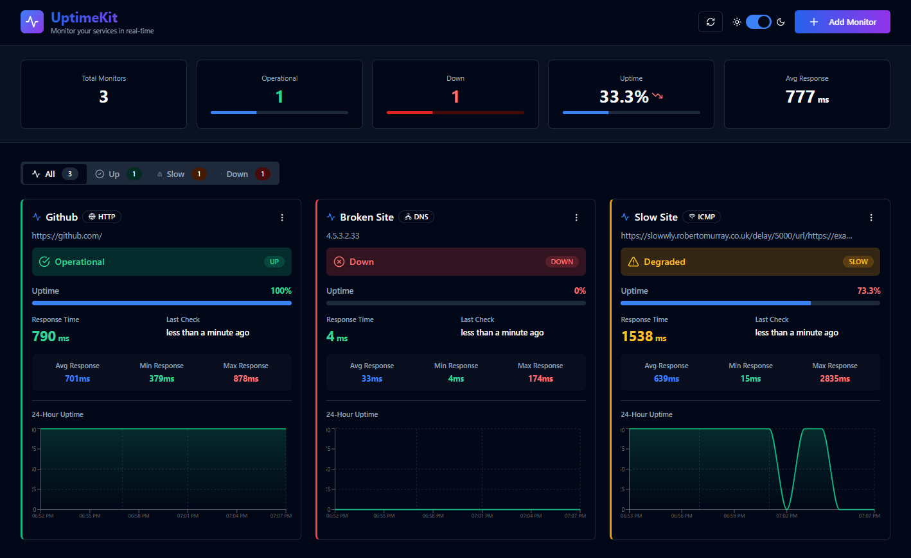

# UptimeKit 🚀

A simple uptime monitoring dashboard to keep track of your websites and APIs. Get real-time updates, beautiful charts, and know exactly when something goes down.

## Preview 



## Features ✨

- Real-time monitoring - checks every minute
- Multiple monitor types: **HTTP/HTTPS**, **DNS**, **ICMP Ping**
- Drag & Drop Reordering - Organize your monitors exactly how you want
- Individual charts for each monitor
- Track response times (avg, min, max)
- Beautiful dark/light mode with **multiple themes** (Midnight, Forest, Cosmic, Claude)
- Mobile responsive - works everywhere
- Edit or delete monitors anytime
- Pause monitoring without losing data
- See exactly when something goes down
- Auto-refreshes every 30 seconds

## Status Colors

- 🟢 **Operational** - Response time < 1000ms
- 🟡 **Degraded** - Response time 1000-5000ms
- 🔴 **Down** - Service unavailable or response time > 5000ms

## Getting Started 🎯

### Docker Setup (Recommended) 🐳

The easiest way to get UptimeKit running is with Docker and Docker Compose!

**Prerequisites:**
- Docker & Docker Compose installed

**Quick Start:**

```bash
# Clone the repository
git clone https://github.com/abhixdd/UptimeKit.git
cd UptimeKit

# Build and start the full stack
docker-compose up --build
```

**Access the application:**
- Frontend: `http://localhost:5173`
- Backend API: `http://localhost:3000`

**Stop the application:**

```bash
docker-compose down
```

**Remove all data and start fresh:**

```bash
docker-compose down -v
```

**How Docker setup works:**
- **Backend container**: Node.js Alpine image running Express server on port 3000
- **Frontend container**: Multi-stage build with Node/Vite for building, nginx for serving on port 5173
- **Database**: SQLite database persists in a Docker volume (`backend-data`)
- **Networking**: Services communicate via Docker internal network

---

### Node.js Setup

For running UptimeKit with Node.js (without Docker), follow these steps.

**Prerequisites:**
- Node.js (v14 or higher)
- npm or yarn

**Installation:**

```bash
# Clone the repository
git clone https://github.com/abhixdd/UptimeKit.git
cd UptimeKit

# Install all dependencies (root, backend, frontend)
npm run install:all
```

**Running the Application:**

```bash
npm run dev
```

This runs both the backend (port 3000) and the frontend dev server concurrently (port 5173).

Open browser: `http://localhost:5173`

**Optional:** Create a `.env` file in the `backend` folder (copy from `.env.example`) to customize the port or other settings.

---

## API Endpoints 📡

- `GET /api/monitors` - Get all monitors
- `POST /api/monitors` - Create monitor
- `PUT /api/monitors/:id` - Update monitor
- `DELETE /api/monitors/:id` - Delete monitor
- `PATCH /api/monitors/:id/pause` - Toggle pause
- `GET /api/monitors/:id/chart/uptime` - Uptime chart data
- `GET /api/monitors/:id/chart/response-time` - Response time chart data
- `GET /api/monitors/:id/history` - Last 30 checks
- `GET /api/monitors/:id/downtime` - Latest downtime period info

## Usage 📖

1. Click "Add Monitor" to add a new website/API to monitor
2. Choose monitor type:
   - **HTTP/HTTPS**: Check website availability and response time
   - **DNS**: Verify DNS resolution
   - **ICMP Ping**: Test connectivity via ping
3. Enter a name and URL (e.g., https://example.com)
4. Monitor status updates automatically every minute
5. View charts, pause, edit, or delete monitors from the menu

## Contributing 🤝

Contributions are welcome! Please feel free to submit a Pull Request.

## License 📄

This project is licensed under the MIT License.

## Support 💬

If you encounter any issues, please open an issue on GitHub: [GitHub Issues](https://github.com/abhixdd/UptimeKit/issues)

## Author 👨‍💻

**Abhi** - [GitHub Profile](https://github.com/abhixdd)

---

**Made with ❤️ for monitoring enthusiasts**

Star ⭐ the repository if you find it helpful!
